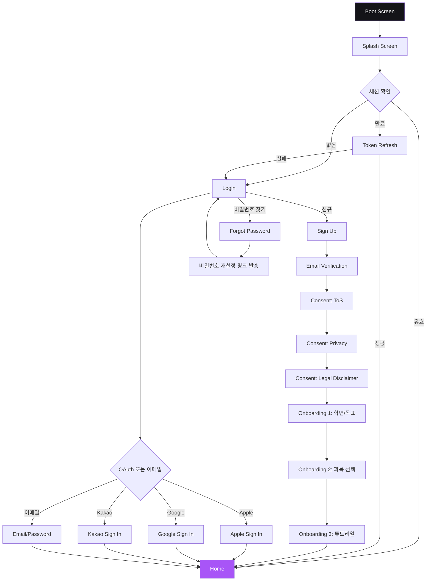
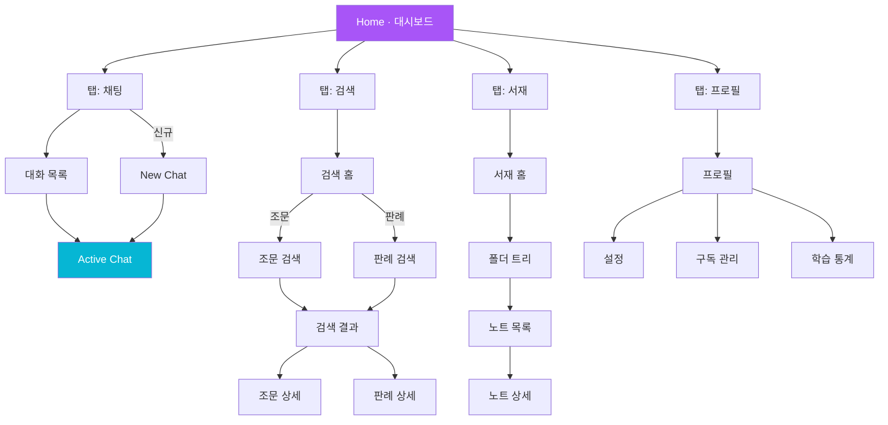
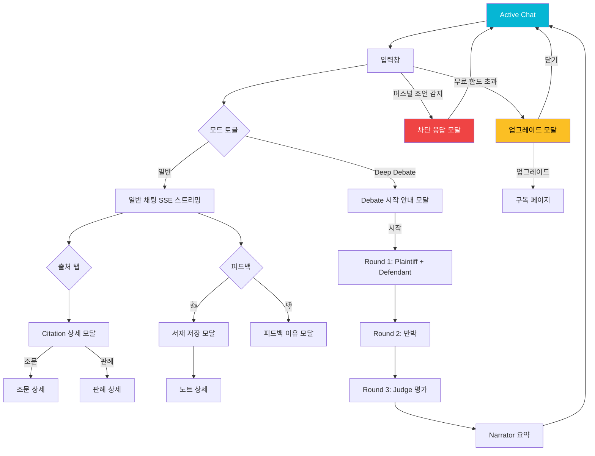
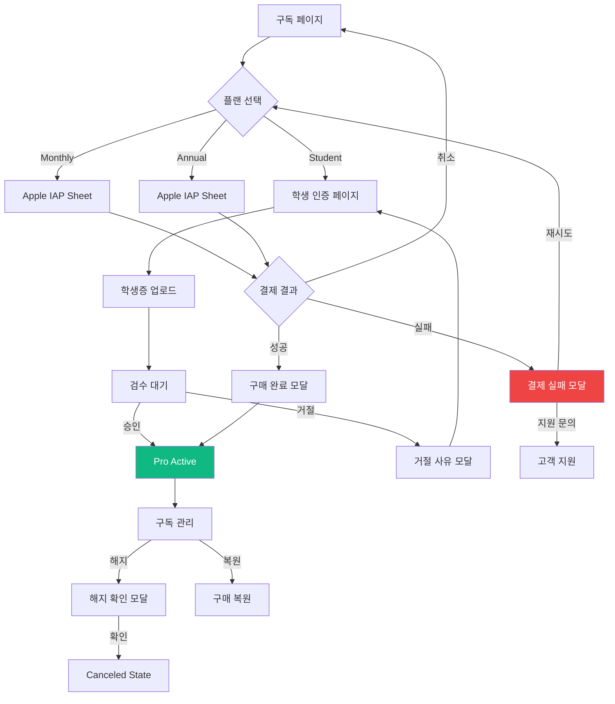
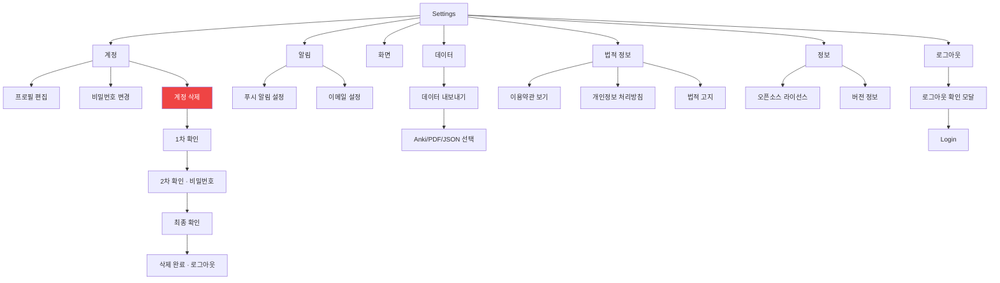
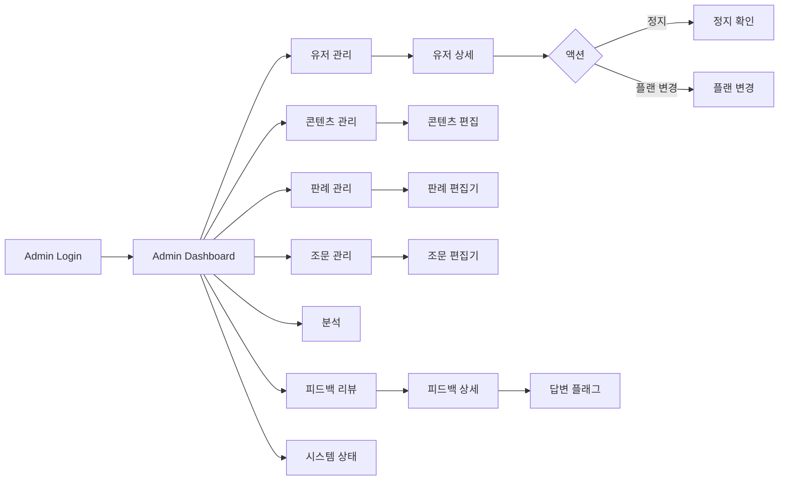

# LAW.OS — User Flow & Screen Map

> **Version**: 1.0
> **Last Updated**: 2026-04-15
> **Stitch Project ID**: `7657386961511176864`

이 문서는 **모든 화면과 모달**이 feature-spec과 동기화되어 있는지 확인하고,
각 화면 간 이동 경로를 시각화합니다. 다이어그램은 **Mermaid** 포맷이며 GitHub에서 자동 렌더링됩니다.

---

## 📊 현재 상태 요약

| 항목 | 개수 |
|------|------|
| Stitch에 존재 | **36** (2026-04-15 P0 일괄 생성 후) |
| feature-spec 기반 필요 총 화면 | 52 |
| ✅ 구현된 핵심 화면 | 14 (기존) + **16 (P0 신규)** = 30 |
| 🟡 중복/재검토 | 2 (Legal OS Home 중복, Command Palette 제거 대상) |
| ❌ 누락 (P1/P2) | 22 (P1 12개, P2 10개) |

### 2026-04-15 P0 일괄 생성 결과

| # | 화면 | Stitch Screen ID |
|---|------|------------------|
| 1 | Forgot Password | `c0779576f7564504b49cd9de57d98655` |
| 2 | Legal Disclaimer Consent | `904599456da14f249d1af5741174cfb5` |
| 3 | Conversation List | `7e49c6e87b694bb8be64631c21f68dee` |
| 4 | Statute Detail | `bc5c1098ac194cc9a3dd95688c4bb06a` |
| 5 | Search Home | `62b5ca3e1d1543d09eb6f4edf2469fda` |
| 6 | Note Detail | `7a071be618304efcbb9c127af58e8e44` |
| 7 | Citation Detail Modal | `4c43ef26103f47ceb25d817eb5e3ecf3` |
| 8 | Save Note Modal | `a86d47bb29a7442c8d9d1c4a16fd0528` |
| 9 | Paywall Modal | `d9bf6414f5334c4b98bef3561b8d2224` |
| 10 | Purchase Result Modal | `242a12fe78ac405b95034ac8455bbc15` |
| 11 | Profile Home | `7638ec9355cb445e90e0bcc5a8fe4c1a` |
| 12 | Edit Profile | `a7820c8ebc0e485b8b488685129e9703` |
| 13 | Legal Pages Viewer | `022f4f3db60e44d1a8b2035c166b0784` |
| 14 | Logout Confirm Modal | `4fcf14fc1eba4c92b1e6d9a0f519d1cd` |
| 15 | Personal Advice Blocked Modal | `c3f65b5f39024964853ec27181e38139` |
| 16 | Empty/Error States Showcase | `84877a9cccd34f7da32377a1b1760430` |

---

## 🎯 전체 유저 플로우 다이어그램

### 다이어그램 1 — 최상위 플로우 (앱 진입 → 홈)



### 다이어그램 2 — 홈에서 주요 기능 (탭 구조)



### 다이어그램 3 — 채팅 화면 상세 (일반 + Deep Debate)



### 다이어그램 4 — 결제 / 구독 플로우



### 다이어그램 5 — 설정 / 계정 관리



### 다이어그램 6 — 관리자 (Admin, Desktop)



---

## 📋 전체 화면 인벤토리 (52개)

### 🚪 Onboarding & Auth (10개)
| # | 화면 이름 | 상태 | Stitch 화면 ID 또는 비고 |
|---|----------|------|------------------------|
| 1 | Boot Screen | ✅ | `b1c599821a294ef49bd78ef8b219b628` |
| 2 | Splash Screen | ✅ | `d8d49a5a8e1942ac8e35f275d820b843` |
| 3 | Login | ✅ | `3f20490d4b48480aa10157ce29d13fe4` |
| 4 | Sign Up | ✅ | `31fb95800e9b401f9319963845a92a87` |
| 5 | Email Verification | ✅ | `45f8e62d452943b8a877440f79ace6f9` |
| 6 | Forgot Password | ❌ | 생성 필요 |
| 7 | Consent: ToS + Privacy + Disclaimer (3 step) | ❌ | 생성 필요 — `legal-ux.md` 참조 |
| 8 | Onboarding 1 (학년/목표) | ✅ | `b0e79726b27b4e36b191ca2f2862e772` |
| 9 | Onboarding 2 (과목 선택) | ✅ | `de39bda81eaf498c902872f1374f9945` |
| 10 | Onboarding 3 (튜토리얼) | ✅ | `75492506a2744e969365715e8be5f675` |

### 🏠 Core (13개)
| # | 화면 이름 | 상태 | 비고 |
|---|----------|------|------|
| 11 | Home (대시보드) | 🟡 중복 | `61eaa61ebb8f4812b897fbb587b634a6` + `7753ff05692544c6975f8d16cb86daaa` 둘 중 하나 정리 |
| 12 | 탭바 네비게이션 (채팅/검색/서재/프로필) | ❌ | 재사용 컴포넌트 |
| 13 | Conversation List (대화 목록) | ❌ | 생성 필요 |
| 14 | New Chat (빈 상태) | ❌ | 생성 필요 |
| 15 | Active Chat (일반) | ✅ | `252821e0257346ba9b713d333b3054df` (Obsidian Terminal) |
| 16 | Deep Debate Chat (4-agent mode) | ❌ | 생성 필요 |
| 17 | Search Home (검색 진입) | ❌ | 생성 필요 |
| 18 | Search Results | ✅ | `d46afa3fb1634c97ba5b0da80aa65580` |
| 19 | Statute Detail (조문 상세) | ❌ | 생성 필요 |
| 20 | Case Detail (판례 상세) | ✅ | `48da99c5072648ce820955f35ccf31ee` (2019다201528) |
| 21 | Library Home (서재 홈 + Folder Tree) | ✅ | `d37ef3bc614e4b13b0d63506db78c46b` (Vault) |
| 22 | Note Detail | ❌ | 생성 필요 |
| 23 | Note Editor | ❌ | 생성 필요 |

### 💳 Billing (6개)
| # | 화면 이름 | 상태 | 비고 |
|---|----------|------|------|
| 24 | Subscription / Pricing | ✅ | `ab817bd31d7446be943259cef6d872ef` |
| 25 | Student Verification | ❌ | 생성 필요 |
| 26 | Paywall Modal (quota exceeded) | ❌ | 생성 필요 |
| 27 | Purchase Success Modal | ❌ | 생성 필요 |
| 28 | Purchase Failure Modal | ❌ | 생성 필요 |
| 29 | Cancel Subscription Confirm | ❌ | 생성 필요 |

### ⚙️ Settings / Profile (9개)
| # | 화면 이름 | 상태 | 비고 |
|---|----------|------|------|
| 30 | Profile Home | ❌ | 생성 필요 |
| 31 | Settings (메인) | ✅ | `5c48c432277b4fc09302be09201dbe2d` |
| 32 | Edit Profile | ❌ | 생성 필요 |
| 33 | Change Password | ❌ | 생성 필요 |
| 34 | Delete Account (3-step confirm) | ❌ | 생성 필요 |
| 35 | Notification Settings | ❌ | 생성 필요 |
| 36 | Export Data Modal (Anki/PDF) | ❌ | 생성 필요 |
| 37 | Legal Pages Viewer (ToS/Privacy/Disclaimer) | ❌ | 생성 필요 |
| 38 | Licenses / About / Version | ❌ | 생성 필요 |

### 🔔 System / Modals (10개)
| # | 화면 이름 | 상태 | 비고 |
|---|----------|------|------|
| 39 | Notifications Log | ✅ | `bde23739fe214028a7c8b71d58c9d1b8` |
| 40 | Citation Detail Modal | ❌ | 생성 필요 |
| 41 | Save Note Modal (👍 후) | ❌ | 생성 필요 |
| 42 | Feedback Reason Modal (👎 후) | ❌ | 생성 필요 |
| 43 | Personal Advice Blocked Modal | ❌ | 생성 필요 — `legal-ux.md` |
| 44 | Debate Start Disclaimer Modal | ❌ | 생성 필요 |
| 45 | Offline Banner / Empty State | ❌ | 생성 필요 |
| 46 | Error 404 / 500 Empty State | ❌ | 생성 필요 |
| 47 | Logout Confirm Modal | ❌ | 생성 필요 |
| 48 | Quota Warning Banner (1회 남음) | ❌ | 생성 필요 |

### 🛠️ Admin (Desktop) — 4개
| # | 화면 이름 | 상태 | 비고 |
|---|----------|------|------|
| 49 | Admin Dashboard | ✅ | `ccd7df1e280041ef88aceb5178dc66d4` |
| 50 | Admin Content Management | ✅ | `9a972990073c43c28ee18e432cba6cc4` |
| 51 | Admin User Management | ❌ | 생성 필요 |
| 52 | Admin Feedback Review | ❌ | 생성 필요 |

---

## 🟡 정리 필요 항목

### 1. Command Palette (⌘K) — **제거 대상**
- Stitch ID: `102a6f0e9d0a40488ccffffd7baa7d36`
- 이유: 모바일은 키보드 단축키 개념이 없음 (사용자가 이전 대화에서 명시)
- 조치: Stitch에서 삭제 또는 "관리자 전용"으로 이동

### 2. Legal OS Home 중복
- `61eaa61ebb8f4812b897fbb587b634a6` (높이 1768)
- `7753ff05692544c6975f8d16cb86daaa` (높이 2162)
- 조치: 최신 버전 하나만 유지하고 나머지 삭제

---

## ❌ 우선순위별 생성 필요 화면

### P0 (MVP 필수) — 16개
Boot → Splash → Login/SignUp → Consent → Onboarding → Home → Chat → Search → Library 핵심 경로.

1. **Forgot Password**
2. **Consent 3-step** (ToS, Privacy, Disclaimer)
3. **Conversation List**
4. **Statute Detail**
5. **Search Home** (탭 진입 화면)
6. **Note Detail**
7. **Citation Detail Modal**
8. **Save Note Modal**
9. **Paywall Modal** (quota exceeded)
10. **Purchase Success/Failure Modals**
11. **Profile Home**
12. **Edit Profile**
13. **Legal Pages Viewer**
14. **Logout Confirm Modal**
15. **Personal Advice Blocked Modal**
16. **Offline / Error Empty States**

### P1 (Launch+30일) — 12개
17. Deep Debate Chat
18. Debate Start Disclaimer Modal
19. Note Editor
20. Change Password
21. Delete Account (3-step)
22. Student Verification
23. Cancel Subscription Confirm
24. Export Data Modal
25. Notification Settings
26. Feedback Reason Modal
27. Quota Warning Banner
28. About/Version/Licenses

### P2 (V1.2+) — 10개
29. New Chat empty state
30. Stats/Analytics screens
31. Admin User Management
32. Admin Feedback Review
33. Push notification preview
34. Deep link handlers
35. Share sheet
36. In-app review prompt
37. Tutorial replay
38. Search filters advanced

---

## 🔗 Stitch 작업 체크리스트

```
Stitch 프로젝트 7657386961511176864에서 해야 할 것:
[ ] Command Palette (⌘K) 화면 제거
[ ] Legal OS Home 중복 정리 (하나만 유지)
[ ] P0 화면 16개 신규 생성
[ ] 모든 화면에 Dark Academia Pro 디자인 시스템 일관 적용
[ ] 모든 모달은 기존 앱 프로젝트 안에 생성 (별도 프로젝트 금지)
```

---

## 💡 다이어그램 관리 규칙

1. 이 문서의 Mermaid 다이어그램은 **feature-spec 변경 시 반드시 동기화**
2. 새 화면 추가 시 → 이 문서의 인벤토리 + 다이어그램 동시 업데이트
3. PR에 "새 화면" 포함 시 이 문서 수정 여부 리뷰 체크
4. GitHub에서 자동 렌더링 확인: https://github.com/Aithor-organization/law-os/blob/master/docs/user-flow.md

---

## 🎨 다음 액션

옵션을 선택하세요:

### A. Stitch에 누락 화면 일괄 생성
- P0 16개 화면을 Stitch로 한 번에 생성 (Dark Academia Pro 시스템 적용)
- 소요: 15~20분

### B. 우선순위 하나씩 생성
- 가장 급한 화면부터 1~2개씩 생성 → 확인 → 다음

### C. 현재 목록만 유지하고 구현 착수
- 있는 화면부터 코드 구현 → 누락 화면은 필요할 때 개별 생성
